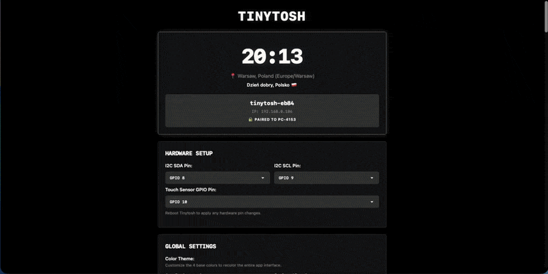

# 🖥️ Tinytosh


> **The open-source, retro-styled desktop companion.** > Part smart display, part hardware monitor, 100% hackable.


---

## 🚀 Get Started (The Easy Way)

**You do not need to compile code to use Tinytosh.** This repository hosts a **Web Installer** and a complete **Interactive Setup Guide**. You can flash your device directly from your browser in under 2 minutes.

[👉 **Launch Setup Guide & Web Flasher**](https://vladimirgitsarev.github.io/Tinytosh/)  
*(Click above to view the assembly guide, wiring diagrams, and configure your device)*

---

## 🧐 What is this?

**Tinytosh** is a DIY project that fits a smart dashboard inside a tiny, 3D-printed Macintosh-style case. It connects to your WiFi to display useful information or hooks up to your PC via USB or Wi-Fi to show real-time hardware stats.

### Available Screens & Services
* 🕒 **Internet Clock:** Auto-syncs time and date based on your location.
* 📅 **Calendar & Holidays:** Displays the current date, a full monthly grid, and tracks national public holidays based on your country.
* 🌤️ **Weather Station:** Live Temperature, Humidity, and Forecasts (via Open-Meteo).
* 🍃 **Air Quality:** Monitor local AQI levels (US & EU Standards).
* ☀️ **Daylight Info:** Tracks sunrise, sunset, solar noon, and day length.
* 📊 **Stock Tracker:** Track market data for **up to 5** global assets, ETFs, and Mega-Cap Tech at once with daily trend indicators.
* 📈 **Crypto Tracker:** Watch **up to 5** of your favorite coins (from top 75 global cryptos) with price and trend indicators.
* 💱 **Currency Tracker:** Track exchange rates for **up to 5** fiat currency pairs with custom scaling multipliers.
* 🖥️ **PC Hardware Monitor:** Connects via **USB** or **Wirelessly** to your Windows/Mac/Linux computer to show CPU Load, RAM Usage, and Network Speeds in real-time!
* 🎧 **PC Media:** Displays currently playing track, artist, album, and playback status streamed directly from your connected computer.
* 🖨️ **Bambu 3D Printer:** Local network telemetry for your Bambu Lab printer (progress, temperatures, fans, and print status) featuring smart layouts for IDLE and PRINTING modes.

### ✨ Key Features
* **Modular Dashboard:** Enable/Disable screens on the fly via a Web Panel or PC App. 
* **🎨 OLED Theme Engine:** Procedural design system. Pick 4 base colors, and the engine automatically calculates all hover states, UI borders, and muted text tones for both the Web Panel and PC app!
* **🔌 Hardware Setup:** Customize your I2C and Touch pinout directly from the Web Panel without touching the code.
* **Smart Location:** Auto-detect your location via IP or manually set your exact coordinates, country, and native timezone.
* **Drag & Drop Reordering:** Fully customize your display sequence. Grab and drag screens to change their order. The configuration UI dynamically rearranges itself to match your custom layout perfectly.
* **Touch Button Controls:** Supports an optional TTP223 touch sensor. Tap to instantly skip screens (or wake the display), and **Long Press** to lock/unlock auto-rotation to keep your favorite screen visible indefinitely.
* **Smart Auto-Hide:** PC Monitor and PC Media screens can intelligently hide themselves and skip rotation when your PC is off, disconnected, or no media is playing.
* **Night Mode & Power Saving:** Set a quiet schedule to minimize sleep distractions. Choose between *Dim Display*, *Turn Display Off*, or *Dim then Turn Off* (featuring an extra time picker for gradual dimming). Features "Smart Latching" (waits for the primary screen before sleeping), 10x slower background API fetching to save power, and a temporary 30-second wake feature via the physical button.
* **Zero Config APIs:** Uses free public APIs. No API keys required.
* **Privacy First:** No accounts, no cloud tracking. Everything runs locally on the ESP32.



---

## 🛠️ The Software Stack

For developers, makers, and the curious, here is how the magic happens. The project consists of two distinct software parts:

### 1. Firmware (ESP32-C3)
*Written in C++ using the Arduino Framework.*

The firmware is designed to be **non-blocking** and **modular**.
* **⚡ Async RTOS:** Employs background FreeRTOS tasks to fetch API data asynchronously. The display and animations stay buttery smooth at 60fps without ever freezing to download data.
* **Universal Config Sync:** The device uses a unified JSON configuration payload, allowing it to instantly accept and apply settings over the local Web Server or via the PC Serial/USB connection.
* **mDNS Support:** Easily access the device's Web Panel without memorizing IPs using its unique local domain (e.g., `http://tinytosh-ab12.local`).
* **Hardware Pairing Lock:** Telemetry streams are protected. Tinytosh securely pairs to the active PC to ensure multiple computers on the same network don't fight over the display.
* **Dynamic Rendering:** The `DisplayService` handles the OLED. It supports "partial screen buffering," allowing for complex transition effects (like dissolving pixels or sliding curtains) without needing a massive frame buffer.

#### 🏗️ Build & Compile Guide

**Web Installer: No Coding Required**

This is the fastest way to get started. You do not need to install VS Code, Arduino, or any drivers.
1.  Connect your ESP32-C3 to your computer via USB.
2.  Open the **[Tinytosh Web Installer](https://vladimirgitsarev.github.io/Tinytosh/)** in a Chromium-based browser (Chrome, Edge, Opera, Brave).
3.  Click **"Connect"** and select your device from the list.
4.  Click **"Install Tinytosh"** to flash the latest firmware automatically.

You can build this project using **PlatformIO** (VS Code) or the **Arduino IDE**.

**Option A: PlatformIO** This is the "Gold Standard" as it manages dependencies automatically. Simply open the project in VS Code and copy the following into your `platformio.ini`:

```ini
[env:esp32-c3-supermini]
platform = espressif32
board = esp32-c3-devkitm-1
framework = arduino
monitor_speed = 115200
build_flags = 
    -D ARDUINO_USB_MODE=1
    -D ARDUINO_USB_CDC_ON_BOOT=1
lib_deps =
    [https://github.com/tzapu/WiFiManager.git](https://github.com/tzapu/WiFiManager.git)
    bblanchon/ArduinoJson @ ^6.21.0
    adafruit/Adafruit SSD1306 @ ^2.5.7
    adafruit/Adafruit GFX Library @ ^1.11.5
    adafruit/Adafruit BusIO @ ^1.14.1
    mathertel/OneButton @ ^2.5.0
```

**Option B: Arduino IDE** If you prefer the Arduino IDE, you must install the external libraries manually via the Library Manager (`Sketch` -> `Include Library` -> `Manage Libraries...`).:

| Library Name | Author | Purpose |
| :--- | :--- | :--- |
| **WiFiManager** | *tzapu* | Captive portal for WiFi setup |
| **ArduinoJson** | *Benoit Blanchon* | Parsing API data and settings |
| **Adafruit SSD1306** | *Adafruit* | Driver for the OLED screen |
| **Adafruit GFX Library** | *Adafruit* | Core graphics and text support |
| **OneButton** | *Matthias Hertel* | Touch button handling and long presses |
| **PubSubClient** | *Nick O'Leary* | MQTT client for Bambu Lab printer telemetry |

> ⚠️ **Important:** When installing `Adafruit SSD1306`, the IDE may ask if you want to install dependencies like **"Adafruit BusIO"**. Click **"Install All"** to ensure the screen works correctly.

**Note on Built-in Libraries:** The following libraries are required but **do not** need to be installed separately. They are included in the ESP32 Board Package:
* `WiFi.h` & `WiFiServer.h`
* `WiFiClientSecure.h`
* `HTTPClient.h`
* `Preferences.h`
* `Wire.h` (I2C)
* `time.h`
* `ESPmDNS.h`

### 2. PC Bridge App (Desktop)
*Written in Rust 🦀 & Tauri.*

To display PC statistics (CPU/RAM/Net) and manage device settings, the ESP32 uses a lightweight helper app running on the computer.
* **Cross-Platform:** Runs on Windows, macOS, and Linux from a single codebase.
* **Dynamic UI Rendering:** The PC app dashboard physically mirrors your device! Configuration panels automatically reorder themselves in real-time to match the exact screen sequence you set on your Tinytosh.
* **Wireless Telemetry (mDNS):** The PC app automatically discovers Tinytosh devices on your local network. You can broadcast your PC's hardware stats completely wirelessly!
* **Smart Connection Fallback:** The app constantly monitors your hardware and instantly prioritizes a wired USB connection for maximum stability. Yank the USB cable? The app instantly and silently falls back to Wi-Fi to keep the data flowing with zero hesitation.
* **Native Telemetry:** Fetches system stats directly from the OS kernel—no third-party bloatware (like AIDA64) required.

**Build it yourself:**
```bash
cd TinytoshPC
npm install
npm run tauri build
```

---

## 🖨️ Hardware & 3D Files

The case is designed to be **screwless**—everything snaps together. 

* **Microcontroller:** ESP32-C3 SuperMini
* **Display:** 0.96" OLED (I2C)
* **Optional:** TTP223 Touch Sensor (for manual screen switching)

You can download the STL/3MF files and view the full bill of materials on MakerWorld:

[**📥 Download 3D Models on MakerWorld**](https://makerworld.com/en/models/2270326-tinytosh-mini-retro-pc-smart-wifi-display-esp32#profileId-2474693)

---

## 🤝 Contributing

Got a cool idea? Did you design a better case? Wrote a module to track your YouTube subs?

**We love pull requests!**
1.  Fork the repo.
2.  Create your feature branch (`git checkout -b feature/AmazingFeature`).
3.  Commit your changes.
4.  Open a Pull Request.

If you encounter bugs or have feature suggestions, please [Open an Issue](https://github.com/VladimirGitsarev/Tinytosh/issues).

---

## 📄 License

This project is licensed under the MIT License - see the [LICENSE](LICENSE) file for details.

* Weather and AQI data provided by [Open-Meteo](https://open-meteo.com/).
* Crypto data provided by [CoinLore](https://www.coinlore.com/cryptocurrency-data-api).
* Stock data provided by [Yahoo Finance](https://finance.yahoo.com/).
* IP Geolocation by [ip-api](https://ip-api.com/).
* Fiat Currency data provided by [fawazahmed0/currency-api](https://github.com/fawazahmed0/exchange-api).
* Public Holidays data provided by [Nager.Date](https://date.nager.at/).
* Daylight data provided by [Sunrise-Sunset](https://sunrise-sunset.org/).

---

## 📅 Changelog

| Version | Date | Key Changes |
| :--- | :--- | :--- |
| **v1.1.3** | *Jul 2026* | 📶 Added **WiFi Speed** screen (download throughput + ping via a Cloudflare speed test, run on each refresh cycle). |
| **v1.1.1** | *Jul 2026* | 🛍️ Merged **Shopify Sales** tracker into the new unified JSON config architecture. 🔄 Added **OTA firmware updates** via the Web Panel (`/update`) — no more USB required for future updates. 🛠️ **Web Installer Fix:** flashing now writes the bootloader, partition table, and app as separate images at their real offsets instead of one full-chip blob, so saved settings in NVS survive a reflash. |
| **v1.1.0** | *Jun 2026* | 🌟 The Architecture & UI/UX Update (Major Release): ☀️ Added **Daylight Info** screen to track solar positioning. 🎨 Introduced **OLED Theme Engine** for procedural 4-color UI generation on Web and PC. 🔌 Added custom hardware pin assignment in Web Panel. 📈 Expanded Stocks, Crypto, and Currency trackers to support up to 5 rotating items. ⚙️ **Firmware Overhaul:** Unified JSON configuration architecture for instant 2-way sync, plus completely rebuilt background data fetching for stutter-free UX. 🖥️ **PC App Upgrade:** New port connection engine, integrated live USB device logs terminal, and fixed other issues. |
| **v1.0.7** | *May 2026* | 📅 Added **Calendar & Holidays** screen (monthly grid, national public holidays, minimalist layout toggle). 🌍 Overhauled manual location entry with precise country/timezone selection. |
| **v1.0.6** | *May 2026* | 🖨️ Added **Bambu 3D Printer** screen (auto-discovery, MQTT telemetry, smart Idle/Active layouts). 🌙 Enhanced **Night Mode** with "Dim then Turn Off" scheduling. |
| **v1.0.5** | *Apr 2026* | 🎧 Added **PC Media** screen (Track, Artist, Album, Status). 👆 Added **Touch Button Controls** (Long press to lock/unlock auto-rotation). 👻 Added **Auto-hide** toggles to completely skip empty PC Monitor and Media screens. 🌐 Added local mDNS domain access (e.g., `tinytosh-XXXX.local`). |
| **v1.0.4** | *Mar 2026* | 🖥️ **PC App Upgrade:** Added **Wireless Telemetry via Wi-Fi (mDNS)**, **Dynamic UI Rendering** that mirrors Web Panel functionality (update device settings and monitor current API data), and **Smart Connection Fallback** (instant USB-to-WiFi switching). <br>⚙️ **Firmware:** Added Universal Config Sync (saving settings via PC app), Smart IP Reporting via Serial, and Hardware Pairing Locks. |
| **v1.0.3** | *Mar 2026* | 🌙 Added **Night Mode** with smart latching, screen dimming/off scheduling, and 10x background API power saving. 🔄 Introduced **Drag & Drop Reordering** for dynamic screen sequencing directly in the Web Panel. |
| **v1.0.2** | *Mar 2026* | 📈 Added **Stock Tracker** module (~100 global assets, ETFs, Mega-Cap Tech, ADRs). Added customizable "Full Name" layout toggles for Crypto, Currency, and Stock screens. Fixed an animation bug for single-screen setups. |
| **v1.0.1** | *Feb 2026* | 💱 Added **Currency Tracker** module (150+ fiat pairs), introduced dynamic multipliers for large conversion gaps, and optimized logging. Expanded Crypto list to top 75. |
| **v1.0.0** | *Initial* | 🚀 Initial release: Time, Weather, AQI, Crypto, and PC Monitor modules. Web Panel, firmware flasher, and 3D printable case released. |

<p align="center">
  <sub>Built with ❤️ and too much coffee.</sub>
</p>